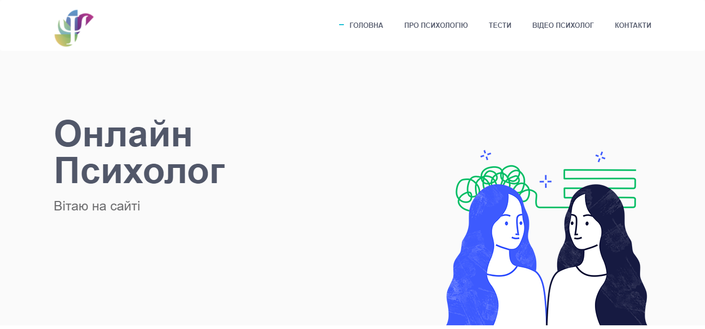
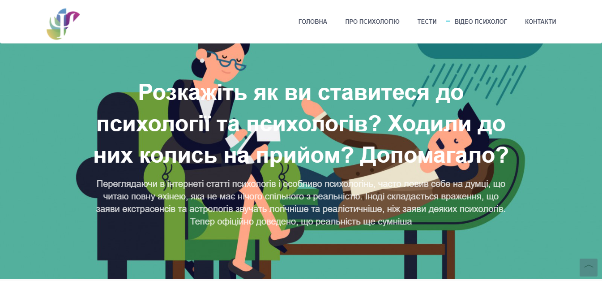
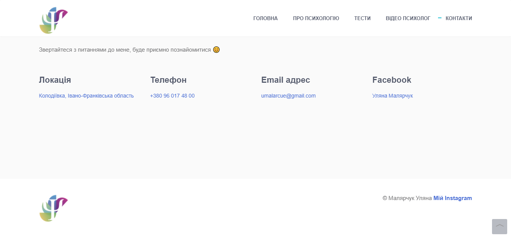
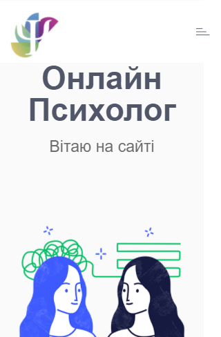
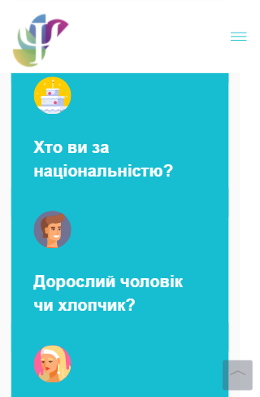
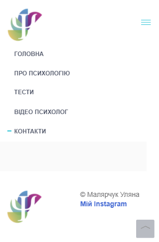

<p align="center"></p>
<h1 align="center">"Онлайн Психолог"</h1>

## Description
<b>EN:</b>

This is a course project that I was ordered.

The project visualizes the work of a business card website with publications on the topic of psychology. There are also a lot of tests to determine the psychological state. Without using the **API**, only the interface will leave.

<b>UA:</b>

Це курсовий проект який в мене заказали.

Проект візуалізує роботу сайту візитки з публікаціями на тему психології. Також присутня пату тестувань для визначення хсихічного стану. Без використання **API** покине лише інтерфейс.

#
## Screenshots
<p>
  
  
  
  
  
  
</p>

#
## Technologies used
<b>EN:</b>
- Using **Bootstrap** (front-end framework)
- Using a third-party template for site layout (built on **Bootstrap**)
- Data storage in files in **JSON** format (without using the **API**)
- Using embedded **YouTube** videos
- Navigation on the site

<b>UA:</b>
- Використання **Bootstrap** (front-end framework)
- Використання стороннього шаблону для макета сайту (на основі **Bootstrap**)
- Зберігання даних у файлах у форматі **JSON** (без використання **API**)
- Використання вбудованих відео **YouTube**
- Навігація по сайту

#
## License
```
© 2022, CoolOtaku (ericspz531@gmail.com)
```
